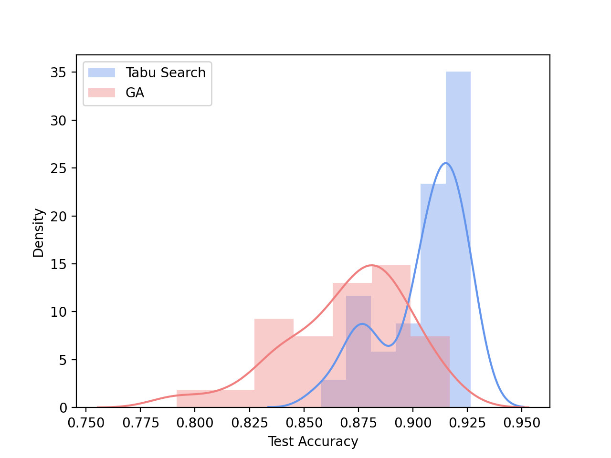
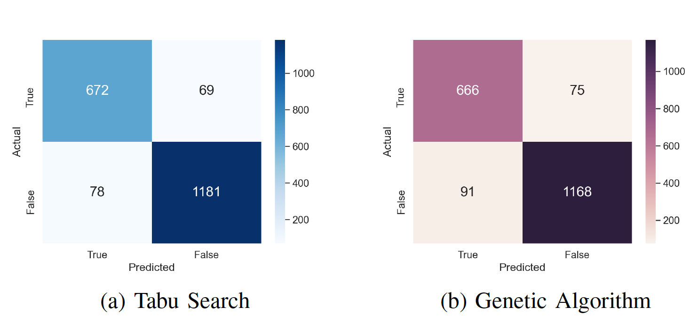

# Optimizing_Feature_Selection_for_ID3
Improving ID3 decision tree algorithm through optimized feature selection using genetic algorithms and tabu search.

In this investigation we compare the efficacy of the tabu search and genetic algorithm metaheuristics in the context of feature subset selection.

### ID3 Decision Tree

The *Iterative Dichotomiser 3 (ID3)* classifier is a well-known decision tree algorithm that uses the *information gain* to select the optimal feature as the splitting condition. However, a major drawback of the ID3 is the tendency of the classifier to overfit. 

In order to overcome this limitation and increase the efficiency of the decision tree structure, feature subset selection can be employed. This introduces
the problem of selecting an optimal feature subset which will retain sufficient information to correctly classify data while reducing overfitting. 

Due to the vast number of potential feature combinations, optimization techniques such as local search or evolutionary techniques can provide a valuable solution.

### Tabu Search

*Tabu search* is a classic search approach which employs a local search procedure to iteratively move from one potential solution to an improved solution in the neighbourhood. Tabu search provides an extension to the classic hill climbing approach by constructing a tabu list of solutions that have been recently visited and are prohibited from being chosen again, as well as allowing the search to escape local optima by selecting a suboptimal movement.

#### Encoding

- For the feature selection problem, each solution is encoded as a bitstring with length equal to the total number of available features. 
- Each bit in the bit string indicates whether that feature is chosen or not.

### Genetic Algorithm

*Genetic algorithms* are a population-based approach to optimization inspired by Darwinian evolution and form a subset of the larger class of evolutionary computation. 

#### Genetic Operators 

- Tournament selection
- Two-point crossover 
- Random mutation

### Results

Through statistical analysis, it is observed that the tabu search approach outperforms the genetic algorithm in the context of feature selection. The graph below indicates the performance distribution of the feature subsets found by each algorithm, for 30 simulations. For each simulation, the performance is measure by the test accuracy obtained using that feature subset.

This is confirmed by a Mann-Whitney U Test which indicates that the test accuracies obtained from the tabu search are greater than the test accuracies from our genetic algorithm at a significance level of 0.025.

To further investigate the classification performance, the confusion matrices obtained by the best subset from each algorithm are included below.

Furthermore, the feature subsets found from the tabu search exhibit significantly more reliable and advantageous results as an average of **90.5%** accuracy is obtained on the test set. This translates to a **2.4%** improvement in accuracy over the baseline accuracy obtained from all 100 input features.

### Report

Improving ID3 through Optimized Feature Selection
